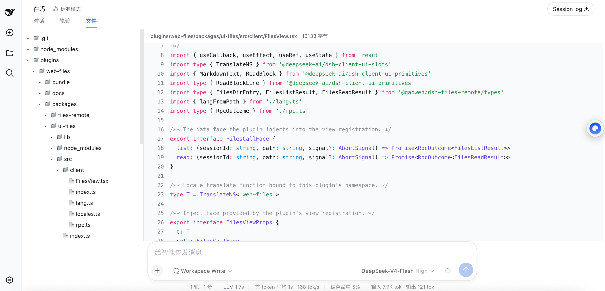
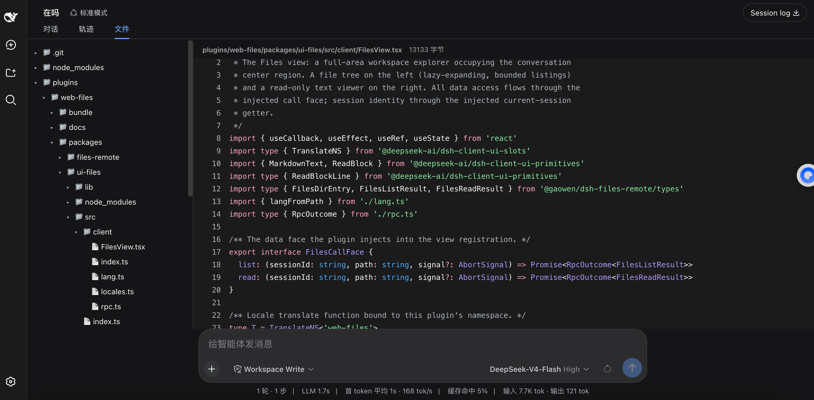

# web-files

English | [中文](README.zh.md)

A read-only workspace file explorer for the [DeepSeek Harness](https://github.com/deepseek-ai/deepseek-harness) (dsh) Web client. Adds a **Files** tab beside Chat and Trajectory in the conversation view: a lazily-expanding file tree on the left, a read-only viewer on the right.


## Features

- **Files tab** in the conversation view (`对话 | 轨迹 | 文件`) — full-area explorer, not a cramped side drawer
- **Markdown preview** for `.md` files through the platform `MarkdownText` renderer (GFM tables, task lists, KaTeX math, theme-adaptive), with a **Preview / Source** toggle
- **Image file viewing** — click any png/jpg/gif/webp/bmp/ico/svg in the tree; it renders in the viewer through the same sandboxed route
- **Relative images render in markdown previews** — workspace-relative `` references resolve through a sandboxed Host image route (workspace-confined, extension-allowlisted, same-origin-fenced)
- **Read-only viewer with syntax highlighting and line numbers** for any text file (platform ReadBlock: shiki grammars, lazy-loaded), with byte count and truncation notice


- **Filename filter box** — case-insensitive substring over loaded directories, with match highlighting; directories stay as the path to deeper matches
- **Pinned tree column** — the file tree never scrolls with the content pane; each side scrolls independently
- **Light & dark themes** follow the shell automatically




## Security model

The browser never touches the filesystem directly. All reads go through a Host-side Typert Remote service (`filesRemote`) that:

- resolves every path through `ctx.fs` and requires canonical containment inside the calling session's workspace — `..` traversal and symlink escapes are rejected;
- bounds directory listings (`maxEntries`, default 1000) and file reads (`maxReadChars`, default 512 KiB) with explicit `truncated` flags;
- is strictly read-only: no write, rename, or delete operation exists on the surface.

## Package layout

| Package | Role |
|---|---|
| `packages/files-remote` | Host half: `filesRemote/list` / `filesRemote/read` Remote methods over `ctx.fs` |
| `packages/ui-files` | Client half: one `conversation.view` slot registration (`id: 'files'`) + browser bundle |
| `bundle/web-files` | Installable profile bundle (the `cordis.patch.yml` patch layer) |

Design details (wire contract, alternatives considered, acceptance criteria): [docs/design.md](docs/design.md).

Feature plan and feasibility tiers: [docs/roadmap.md](docs/roadmap.md).

## Install

From a checkout of this repository (build first — `lib/` artifacts are gitignored except Typert descriptors):

```sh
pnpm install && pnpm build

dsh plugin --profile web add link:$(pwd)/plugins/web-files/bundle/web-files
dsh plugin --profile web add link:$(pwd)/plugins/web-files/packages/files-remote \
                                link:$(pwd)/plugins/web-files/packages/ui-files

dsh web   # restart; the tab appears in every session header
```

## Compatibility

Built against dsh `0.1.0-rc` packages; zero upstream code changes — everything attaches through documented extension points (Typert Remote service discovery, slot registrations, profile bundles).
