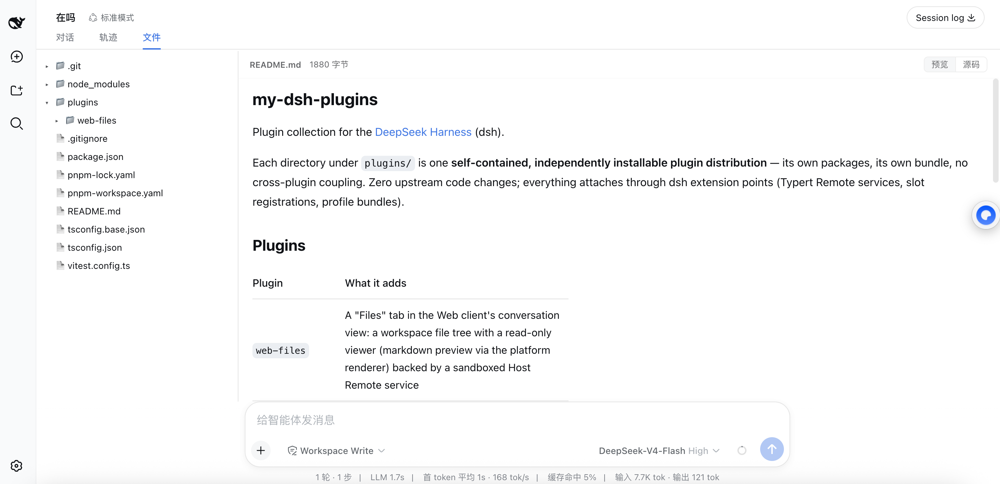
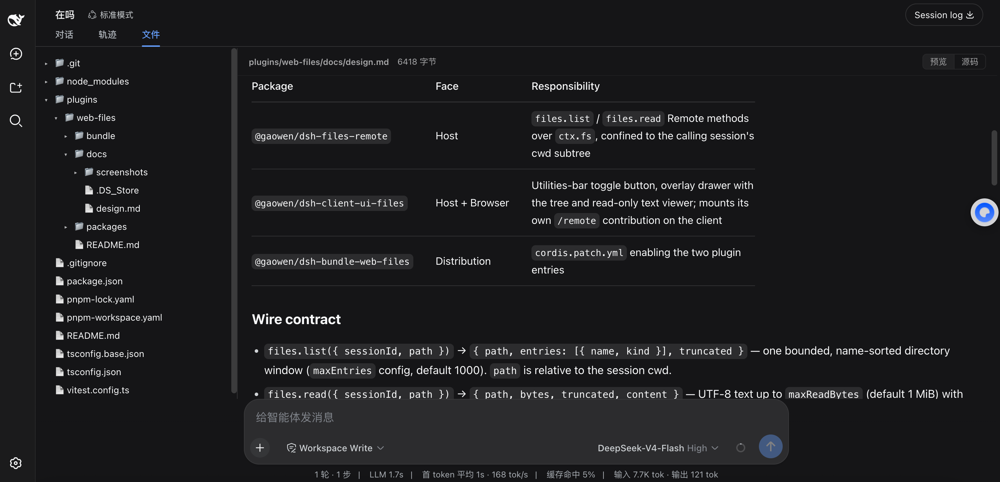

# web-files

[English](README.md) | 中文

为 [DeepSeek Harness](https://github.com/deepseek-ai/deepseek-harness)（dsh）Web 客户端提供的只读工作区文件浏览器。在会话视图的"对话、轨迹"旁新增一个 **文件** tab：左侧是懒加载展开的文件树，右侧是只读查看器。



## 功能

- **文件 tab**（`对话 | 轨迹 | 文件`）—— 占满整个会话中区的浏览器，不是挤在边上的小抽屉
- **Markdown 预览**：`.md` 文件经平台 `MarkdownText` 渲染器呈现（GFM 表格、任务列表、KaTeX 公式、自动适配主题），支持 **预览 / 源码** 切换
- **只读文本查看**：任意文本文件，显示字节数与截断提示
- **树栏固定**：文件树不随内容区滚动，两侧各自独立滚动
- **明暗主题**自动跟随外壳



## 安全模型

浏览器不直接接触文件系统。所有读取经 Host 侧 Typert Remote 服务（`filesRemote`）：

- 每个路径经 `ctx.fs` canonical 化后必须落在调用会话的工作区之内——`..` 穿越与 symlink 逃逸均被拒绝；
- 目录列表（`maxEntries`，默认 1000）与文件读取（`maxReadChars`，默认 512 KiB）有界，带显式 `truncated` 标志；
- 严格只读：表面上不存在任何写、重命名、删除操作。

## 包结构

| 包 | 职责 |
|---|---|
| `packages/files-remote` | Host 半边：`filesRemote/list` / `filesRemote/read`，走 `ctx.fs` |
| `packages/ui-files` | Client 半边：一个 `conversation.view` 插槽注册（`id: 'files'`）+ 浏览器 bundle |
| `bundle/web-files` | 可安装的 profile bundle（`cordis.patch.yml` 补丁层） |

设计细节（wire 契约、备选方案、验收标准）：[docs/design.md](docs/design.md)。

功能规划与可行性分级：[docs/roadmap.md](docs/roadmap.md)。

## 安装

在本仓库检出后（先构建——`lib/` 产物除 Typert 描述符外不入库）：

```sh
pnpm install && pnpm build

dsh plugin --profile web add link:$(pwd)/plugins/web-files/bundle/web-files
dsh plugin --profile web add link:$(pwd)/plugins/web-files/packages/files-remote \
                                link:$(pwd)/plugins/web-files/packages/ui-files

dsh web   # 重启后，每个会话头部出现该 tab
```

## 兼容性

基于 dsh `0.1.0-rc` 系列构建；零上游代码改动——全部通过文档化的扩展点接入（Typert Remote 服务发现、插槽注册、profile bundle）。
